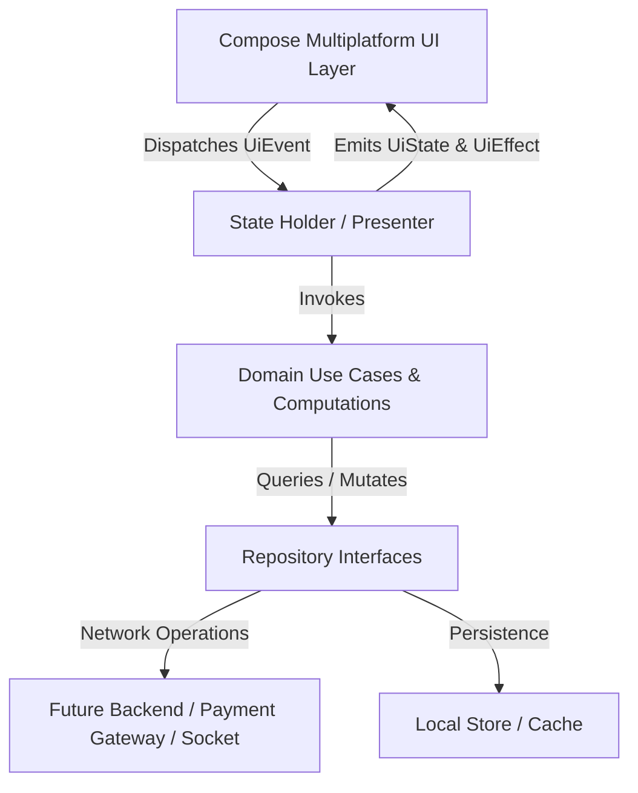

# KidsG Mobile Architecture

**Product:** KidsG — Quick-Commerce for School Supplies & Stationery  
**Tagline:** *Small Supplies. Big Futures.*  
**Multiplatform Technology:** Kotlin Multiplatform (KMP) + Compose Multiplatform (Android & iOS)

---

## 1. High-Level Architectural Model

KidsG is architected as a feature-oriented, unidirectional data flow (UDF) client application. It serves two distinct audiences simultaneously:
1. **Students**: Delightful, tactile stationery playground with intent-based discovery, expressive animations, and emergency "Oops" modes.
2. **Parents**: Clutter-free, high-trust checkout and a calm Parent Zone focused on orders, payment receipts, refunds, and support.



---

## 2. Directory & Module Structure

```text
KidsG/
├── androidApp/                       # Android Entry Application (SDK 35, Manifest, ProGuard)
│   ├── src/main/java/com/kidsg/app/  # MainActivity.kt
│   └── src/main/res/                 # Android resources, launcher drawables
├── iosApp/                           # iOS Native Entry (SwiftUI ContentView, AppDelegate)
├── shared/                           # Kotlin Multiplatform Core Logic & Compose UI
│   └── src/
│       ├── commonMain/kotlin/com/kidsg/
│       │   ├── core/
│       │   │   ├── designsystem/     # Colors, Typography, Shapes, Spacing, Icons, Motion, Components
│       │   │   ├── navigation/       # Type-safe Screen destinations
│       │   │   ├── payment/          # PaymentService abstraction (Rule #6)
│       │   │   └── services/         # Delivery, Notification, Location, Analytics interfaces (Rule #7)
│       │   ├── domain/
│       │   │   ├── model/            # Product, Category, Cart, Order, Store, DeliveryConfig, Coupon
│       │   │   └── repository/       # ProductRepository, CartRepository, ConfigRepository, OrderRepository
│       │   ├── data/
│       │   │   ├── mock/             # KidsGMockData (30+ products, categories, intent modes, stores)
│       │   │   └── repository/       # Mock implementations adhering strictly to domain configs
│       │   └── feature/              # Feature-oriented UI modules (Rule #12)
│       │       ├── app/              # KidsGApp coordinator and scaffold
│       │       ├── splash/           # Hero 1: Branded organic line animation & mascot
│       │       ├── home/             # Hero 2: The KidsG Desk (Greeting, Search, Sticky Notes)
│       │       ├── discovery/        # Hero 3: The Stationery Wall, Intent Modes, Oops Emergency
│       │       ├── product/          # Hero 4: Product Desk View with specs and variants
│       │       └── bag/              # Hero 5: Your School Bag packing cart & dynamic bills
│       ├── commonTest/kotlin/com/kidsg/domain/ # Automated Cart, Coupon, and Order tests
│       ├── androidMain/              # Android actuals (AndroidPlatform)
│       └── iosMain/                  # iOS actuals (IOSPlatform)
├── docs/                             # Engineering specifications & runbooks
├── gradle/                           # Gradle 8.9 wrapper & libs.versions.toml
├── build.gradle.kts
└── settings.gradle.kts
```

---

## 3. The 5 Hero Experiences (Milestone 1)

1. **Animated KidsG Splash**: Organic pencil stroke logo reveal + mascot interaction.
2. **KidsG Desk Home**: Dynamic desk composition, greeting, search, sticky note intent modes, nearby store status.
3. **Discovery / Intent Modes**: Stationery Wall categories + School, Exam, Create, and Oops Mode emergency drawers.
4. **Product Desk View**: Realistic stationery desk placement, specs, ruling/tip variants, pricing, stock, add to bag.
5. **Your School Bag**: Visual school bag packing metaphor, item list, dynamic coupon drawer, repository-driven pricing breakdown.

---

## 4. Business Rule Engine & Non-Hardcoded Values

In compliance with Rule #5, all transactional and operational numbers are dynamically provided by `DeliveryConfig` and `ConfigRepository`:
- Base Delivery Fee: `₹30.0`
- Free Delivery Threshold: `₹199.0`
- Govt. GST Tax: `5.0%`
- Platform Fee: `₹5.0`
- Express ETA: `12–18 mins`
- Minimum Order Value: `₹40.0`
- Coupons: `KIDSG50`, `EXAMREADY`, `FIRSTDESK` with min order and maximum discount caps.

---

## 5. Security & Payment Authority

Per Rule #6:
- The customer mobile client **never** determines payment success on its own.
- All payments flow through `PaymentService`:
  1. Client calls `initiatePayment()` → Backend generates authenticated transaction token.
  2. Client launches gateway SDK / UPI intent.
  3. Client polls or listens for `verifyPayment()` → authoritative backend verification with webhook.
